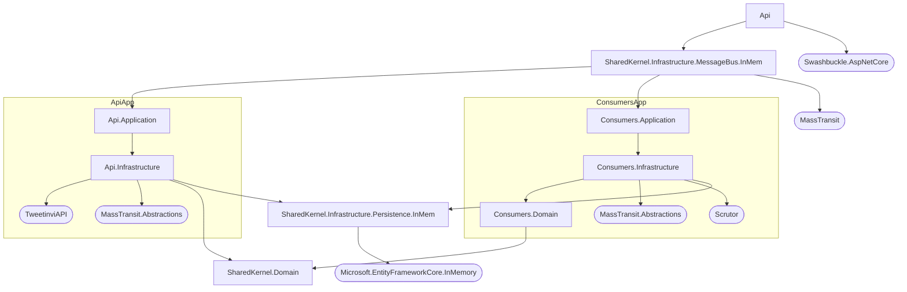

# TwitterStreamAnalytics

Analyzing the [Twitter 1% Sample Stream](https://developer.twitter.com/en/docs/twitter-api/tweets/sampled-stream/introduction) in .NET

## Get Started

### Configuration

Add a [Twitter App Bearer Token](https://developer.twitter.com/en/docs/authentication/oauth-2-0/bearer-tokens) as an [environment variable](https://docs.microsoft.com/en-us/aspnet/core/security/app-secrets?view=aspnetcore-6.0&tabs=windows#environment-variables):

```
Twitter__AppBearerToken=
```

or [secret](https://docs.microsoft.com/en-us/aspnet/core/security/app-secrets?view=aspnetcore-6.0&tabs=windows#secret-manager):

```
"Twitter:AppBearerToken": ""
```

### Run

1. Start the TwitterStreamAnalytics.Api project in Visual Studio.
2. Use the Swagger UI that appears to interact with the app.

## Architecture

By design, the Consumers application could be extracted to an independent process supporting high-throughput via the competing consumers pattern. The message broker transport could be swapped from in-memory to a persistent/scalable provider such as RabbitMQ. The Entity Framework Core provider could be swapped from in-memory to a persistent/scalable provider such as Cosmos DB. The app seeks to align with DDD and CQRS patterns to support increasing feature complexity.


